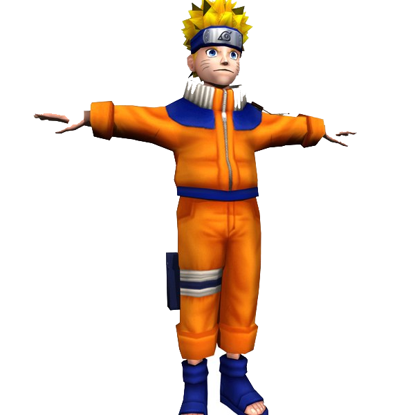

# Naruto-AR




> Este projeto visa fornecer uma experiência ludica ao utilizador, baseada na série icónica Naruto. Existe a possibilidade de serem detectados movimentos de mãos e poses e comparados com movimentos e gestos icónicos da série e serem despoletados efeitos visuais de acordo.


## 💻 Pré-requisitos

Antes de começar, verifique se atende aos seguintes requisitos:

- Instalou a versão mais recente de mediapipe, opencv, PIL e python 3.10.
- Possuí uma máquina com o sistema operativo windows 10 ou superior.
- Leu o guia de como usar a aplicação.

## 🚀 Instalando NarutoAR

Para instalar o Naruto, siga estas etapas:

Windows:

```
pip install mediapipe ultralytics PIL opencv-python
python .\NarutoAR.py
```

## ☕ Usando NarutoAR

Para usar NarutoAR, siga estas etapas:

```
Corra os ficheiros dentro da pasta utils para gravar os seus gestos costumizados e dê-lhes um nome correspondente a depois ser usado no NarutoAR.py (Poses = "guy" "lee" "naruto" "chidori" "gaara" , Gestos de mão= "rasengan" "clones" "fist" "circle" "fireball")
Estas gravações irão utilizar a sua captura de cordenadas para depois compara-las em tempo real com os movimentos iconicos da série e despoletar efeitos visuais.
Após isso ou mesmo sem o fazer simplesmente corra o NarutoAR.py e pressione 'h' para mudar para a deteção de mãos, 'p' para a deteção de poses e 'o' para a deteçao de objetos e presencie os efeitos visuais a serem despoletados.
```


## 🤝 Colaboradores

Agradecemos às seguintes pessoas que contribuíram para este projeto:

<table>
  <tr>
    <td align="center">
      <a href="#" title="defina o título do link">
        <br>
        <sub>
          <b>João Sousa</b>
        </sub>
      </a>
    </td>
    
</table>

